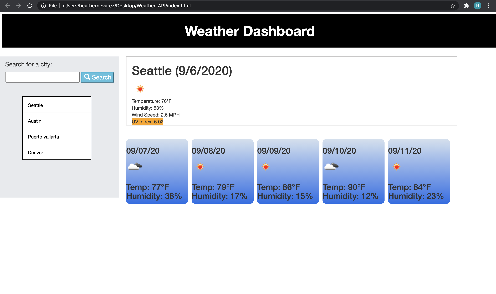

# Weather-API

This weather API app allows users to search for weather information in any city. Just type the name of the city in the search bar, click "search", and the current weather conditions will display, as well as the forecast for the next 5 days. The app also saves search history in buttons, so you can easily click on the button to see weather information for that city instead of having to enter the search again. These searches are saved in local storage so if you refresh the page you will still be able to see previous searches.

Link to webpage: https://heathernev88.github.io/Weather-API/ 

